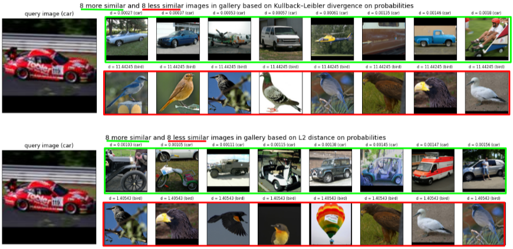
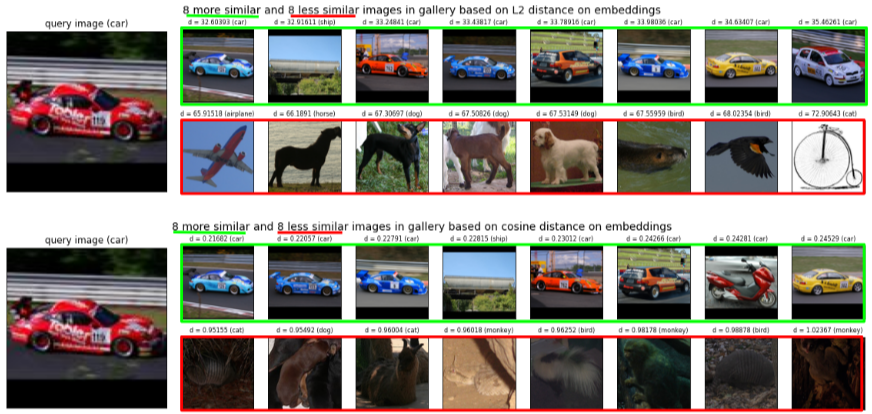

# Big Data Computing project

## Overview

This notebooks are part of the project for the [Big Data Computing AY2020/21 course](https://github.com/gtolomei/big-data-computing) teached by Prof. Gabriele Tolomei

Resources:
- the [notebook](https://github.com/rom42pla/big_data_project/blob/main/notebook_full.ipynb) 
- a [demo version of the notebook](https://github.com/rom42pla/big_data_project/blob/main/notebook_demo.ipynb) without the training parts
- a [brief presentation](https://drive.google.com/file/d/1U7q5Gj-56AYK8tfbTeIhcAZjBH98TB51/view?usp=sharing) of this project


The project has been done by:
- Romeo Lanzino, matricola `1753403`, email `lanzino.1753403@studenti.uniroma1.it`
- Federico Fontana, matricola `1744946`, email `fontana.1744946@studenti.uniroma1.it`


### Task
We have decided to tackle **semi-supervised multi-class images classification**, consisting of a dataset with both labeled and (a large amount of) unlabeled samples [_\[Van Engelen, Hoos, 2019, A survey on semi-supervised learning\]_](https://link.springer.com/content/pdf/10.1007/s10994-019-05855-6.pdf)

### Dataset
We've chosen [STL-10](https://cs.stanford.edu/~acoates/stl10/) [_\[Coates, Lee, Ng, 2011, An Analysis of Single Layer Networks in Unsupervised Feature Learning\]_](https://cs.stanford.edu/~acoates/papers/coatesleeng_aistats_2011.pdf), which is an image recognition dataset with a corpus of 100K unlabeled images, 5K labeled training images and 8K labeled test images, covering 10 different classes.

### Workflow

- download, analyze and **preprocess the dataset**
- contrast the curse of dimensionality using **dimensionality reduction** techniques such as a CNN
- **train a model** (such as a MLP) on the labeled training images
- **pseudo-label** the unlabeled images using the model trained in the previous step
- **train a second model** using also the pseudo-labeled images
- **evaluate** the results of both models to see if there have been some improvements
- implement an **image search engine** that, given a query image as input, returns a list of relevant images in a gallery (disjointed from the query images set) 

## Results

### Classification

Evaluation results on `df_test` using base model:
```
{'accuracy': 0.669375,
 'f1': 0.6717551753303268,
 'weightedFalsePositiveRate': 0.036736111111111115,
 'weightedPrecision': 0.680093714461409,
 'weightedRecall': 0.669375,
 'weightedTruePositiveRate': 0.669375}
```

Evaluation results on `df_test` using final model:
```
{'accuracy': 0.660375,
 'f1': 0.6616909977888196,
 'weightedFalsePositiveRate': 0.03773611111111111,
 'weightedPrecision': 0.6654451885476704,
 'weightedRecall': 0.660375,
 'weightedTruePositiveRate': 0.660375}
```

### Search engine (example)





### How to check our results?

- if you're starting from scratch then just run `notebook_full.ipynb`, that also trains and saves the models to `dbfs` for faster re-use
- if you already have the models saved to `dbfs`, just run `notebook_demo.ipynb`: you'll spare a lot of time!

