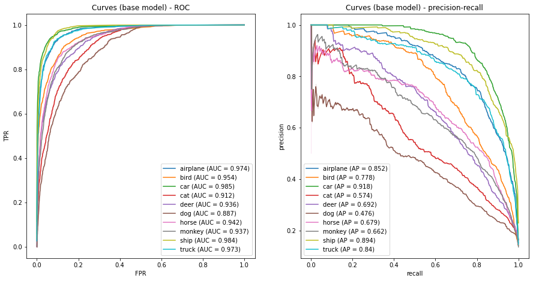
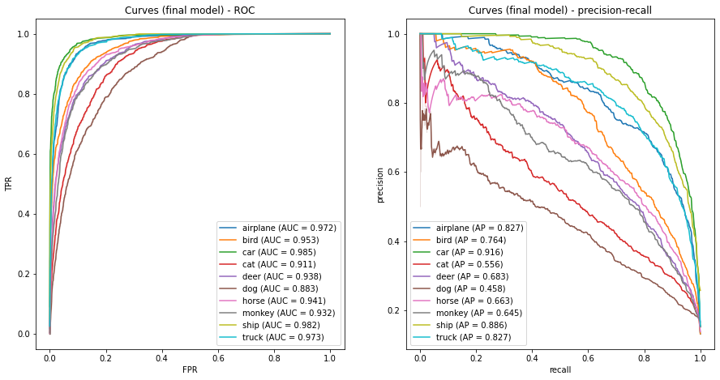
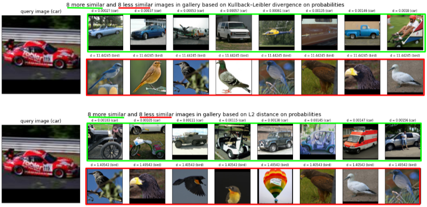
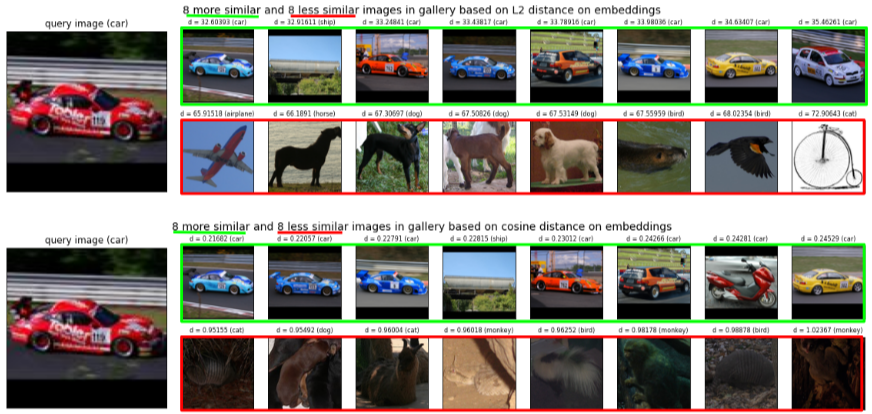
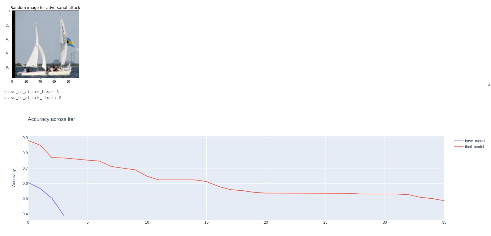

# Big Data Computing project

 ## Overview

This notebooks are part of the project for
the [Big Data Computing AY2020/21 course](https://github.com/gtolomei/big-data-computing) teached by Prof. Gabriele
Tolomei

Resources:

- the [notebook with the training parts](https://github.com/rom42pla/big_data_project/blob/main/notebook_training.ipynb) 
  (also [published on DataBricks](https://databricks-prod-cloudfront.cloud.databricks.com/public/4027ec902e239c93eaaa8714f173bcfc/3816168353014773/3331917203481792/3248872990014382/latest.html))
- a [demo notebook](https://github.com/rom42pla/big_data_project/blob/main/notebook_demo.ipynb) without the training
  parts and with the evaluation, search engine and adversarial attack phases (
  also [published on DataBricks](https://databricks-prod-cloudfront.cloud.databricks.com/public/4027ec902e239c93eaaa8714f173bcfc/3816168353014773/3017902888537112/3248872990014382/latest.html))
- a [brief presentation](https://github.com/rom42pla/big_data_project/blob/main/presentation.pdf) of this project (
  also [on Google Docs](https://drive.google.com/file/d/1U7q5Gj-56AYK8tfbTeIhcAZjBH98TB51/view?usp=sharing))
- [preprocessed dataset’s folder](https://drive.google.com/drive/u/1/folders/1te7m9u-FkjxYeopz1AG6N4wP-GoMDyBi) on
  Google Drive

The project has been done by:

- Romeo Lanzino, matricola `1753403`, email `lanzino.1753403@studenti.uniroma1.it`
- Federico Fontana, matricola `1744946`, email `fontana.1744946@studenti.uniroma1.it`


### Task

We have decided to tackle **semi-supervised multi-class images classification**, consisting of a dataset with both
labeled and (a large amount of) unlabeled samples [_\[Van Engelen, Hoos, 2019, A survey on semi-supervised
learning\]_](https://link.springer.com/content/pdf/10.1007/s10994-019-05855-6.pdf)

### Dataset

We've chosen [STL-10](https://cs.stanford.edu/~acoates/stl10/) [_\[Coates, Lee, Ng, 2011, An Analysis of Single Layer
Networks in Unsupervised Feature Learning\]_](https://cs.stanford.edu/~acoates/papers/coatesleeng_aistats_2011.pdf),
which is an image recognition dataset with a corpus of 100K unlabeled images, 5K labeled training images and 8K labeled
test images, covering 10 different classes.

### Workflow

- download, analyze and **preprocess the dataset**
- contrast the curse of dimensionality using **dimensionality reduction** techniques such as a CNN
- **train a model** (such as a MLP) on the labeled training images
- **pseudo-label** the unlabeled images using the model trained in the previous step
- **train a second model** using also the pseudo-labeled images
- **evaluate** the results of both models to see if there have been some improvements
- implement an **image search engine** that, given a query image as input, returns a list of relevant images in a
  gallery (disjointed from the query images set)
- perform an example of **adversarial attack**

### How to run the notebooks

Check [instructions.md](instructions.md)

## Results

### Classification

#### Base model

```
{'accuracy': 0.669375,
 'f1': 0.6717551753303268,
 'mcc': 0.6335526776740902,
 'weightedFalsePositiveRate': 0.036736111111111115,
 'weightedPrecision': 0.680093714461409,
 'weightedRecall': 0.669375,
 'weightedTruePositiveRate': 0.669375}
 
              precision    recall  f1-score   support

    airplane       0.74      0.81      0.77       800
        bird       0.68      0.69      0.68       800
         car       0.85      0.82      0.84       800
         cat       0.54      0.47      0.50       800
        deer       0.64      0.62      0.63       800
         dog       0.42      0.59      0.49       800
       horse       0.66      0.62      0.64       800
      monkey       0.66      0.53      0.59       800
        ship       0.86      0.76      0.81       800
       truck       0.76      0.78      0.77       800

    accuracy                           0.67      8000
   macro avg       0.68      0.67      0.67      8000
weighted avg       0.68      0.67      0.67      8000
```



#### Final model

```
{'accuracy': 0.660375,
 'f1': 0.6616909977888196,
 'mcc': 0.6229632711502258,
 'weightedFalsePositiveRate': 0.03773611111111111,
 'weightedPrecision': 0.6654451885476704,
 'weightedRecall': 0.660375,
 'weightedTruePositiveRate': 0.660375}
 
              precision    recall  f1-score   support

    airplane       0.73      0.74      0.74       800
        bird       0.67      0.67      0.67       800
         car       0.86      0.80      0.83       800
         cat       0.53      0.49      0.51       800
        deer       0.61      0.64      0.63       800
         dog       0.44      0.54      0.48       800
       horse       0.64      0.64      0.64       800
      monkey       0.64      0.53      0.58       800
        ship       0.79      0.80      0.79       800
       truck       0.75      0.76      0.75       800

    accuracy                           0.66      8000
   macro avg       0.67      0.66      0.66      8000
weighted avg       0.67      0.66      0.66      8000
```



### Search engine (example)




### Adversarial attack (example)


